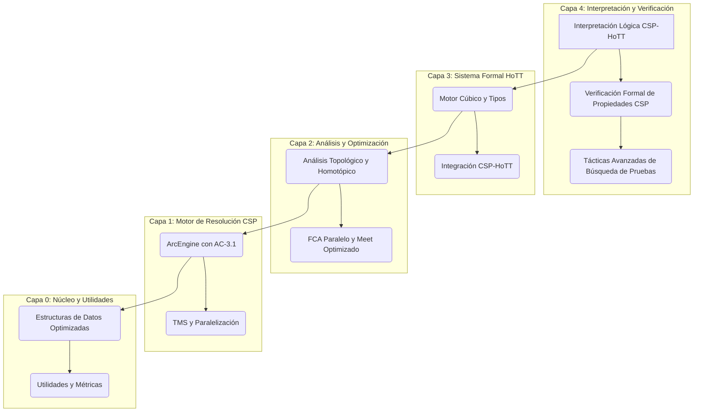

# Análisis Arquitectónico y Propuestas de Mejora para LatticeWeaver v5

**Autor:** Manus AI
**Fecha:** 11 de Octubre de 2025
**Versión:** 1.0

---

## 1. Introducción

Este documento presenta un análisis exhaustivo de la arquitectura final de **LatticeWeaver v4**, un sistema avanzado de verificación formal y resolución de restricciones que integra Problemas de Satisfacción de Restricciones (CSP) con la Teoría de Tipos Homotópica (HoTT). Tras la finalización de todas las fases de implementación, incluida la "Interpretación Lógica Completa de CSP en HoTT", este análisis evalúa las fortalezas y debilidades del diseño actual y propone una hoja de ruta para el desarrollo de una futura **versión 5**.

El objetivo de este análisis es proporcionar una visión crítica y constructiva que guíe las futuras iteraciones del proyecto, asegurando que LatticeWeaver continúe a la vanguardia de la verificación formal y la resolución de problemas complejos.

## 2. Arquitectura Final de LatticeWeaver v4

LatticeWeaver v4 está estructurado en una arquitectura de múltiples capas, diseñada para separar las preocupaciones y maximizar la modularidad. Cada capa se basa en la anterior, desde la resolución de restricciones de bajo nivel hasta la verificación formal de alto nivel.

A continuación se presenta un diagrama que ilustra la arquitectura final del sistema:

### Descripción de las Capas

*   **Capa 0: Núcleo y Utilidades:** Proporciona las estructuras de datos fundamentales (dominios, restricciones serializables) y las herramientas de soporte, como la gestión de estado y las métricas de rendimiento.

*   **Capa 1: Motor de Resolución CSP:** El corazón del sistema de resolución de restricciones. Incluye el motor `ArcEngine` con el algoritmo AC-3.1, el Truth Maintenance System (TMS) para la gestión de dependencias y la capacidad de paralelización real mediante `multiprocessing`.

*   **Capa 2: Análisis y Optimización:** Contiene los componentes de análisis y optimización, como el Análisis Formal de Conceptos (FCA) en paralelo, la operación `meet` optimizada para álgebras de Heyting y los analizadores topológicos y homotópicos.

*   **Capa 3: Sistema Formal HoTT:** Implementa el sistema de tipos basado en HoTT, con un motor cúbico (`CubicalEngine`), un verificador de tipos y la integración inicial con el motor CSP.

*   **Capa 4: Interpretación y Verificación:** La capa más abstracta, donde se realiza la verificación formal. Incluye la interpretación lógica completa de CSP en HoTT, la verificación de propiedades CSP y las tácticas avanzadas para la búsqueda de pruebas.

## 3. Análisis de Fortalezas y Debilidades

### Fortalezas

1.  **Alta Modularidad y Cohesión:** La arquitectura en capas permite un desarrollo y mantenimiento más sencillos. Cada módulo tiene una responsabilidad clara y las dependencias están bien definidas.

2.  **Integración Profunda de CSP y HoTT:** LatticeWeaver v4 no solo utiliza HoTT para verificar los resultados de un solucionador de CSP, sino que establece una correspondencia profunda entre los conceptos de ambos dominios (la correspondencia Curry-Howard para CSP).

3.  **Rendimiento Optimizado:** Se han implementado múltiples optimizaciones, desde la paralelización del algoritmo AC-3 y FCA hasta la caché de operaciones `meet` y revisiones de arcos.

4.  **Robustez y Verificación:** El sistema cuenta con una suite de más de 75 tests que cubren todas las funcionalidades clave, asegurando la correctitud y estabilidad del código.

5.  **Extensibilidad:** La arquitectura está diseñada para ser extendida. La adición de nuevas tácticas, propiedades verificables o semánticas de interpretación es relativamente sencilla.

### Debilidades

1.  **Complejidad de la Base de Código:** La profundidad de la integración y la cantidad de capas hacen que la base de código sea extensa y compleja, lo que puede dificultar la incorporación de nuevos desarrolladores.

2.  **Dependencia de Pruebas Axiomáticas:** En la fase final de interpretación lógica, algunas pruebas de satisfacibilidad de restricciones se basan en axiomas (`Var("proof_...")`). Aunque esto es una práctica común, un sistema más avanzado podría generar estas pruebas de forma constructiva.

3.  **Escalabilidad del Verificador de Tipos:** El verificador de tipos actual, aunque funcional, podría convertirse en un cuello de botella al trabajar con pruebas muy grandes y complejas. No está optimizado para la normalización de términos a gran escala.

4.  **Falta de Herramientas de Depuración Visual:** El sistema genera pruebas y trazas de ejecución complejas, pero carece de herramientas visuales para inspeccionar el espacio de búsqueda, las dependencias del TMS o la estructura de las pruebas formales.

## 4. Propuestas de Mejora para LatticeWeaver v5

A continuación se presentan varias propuestas para una futura versión 5, diseñadas para abordar las debilidades identificadas y expandir las capacidades del sistema.

### 4.1. Unificación de Motores de Inferencia y Tácticas

**Problema:** Actualmente, el `CubicalEngine` y el `TacticEngine` operan de forma separada. El motor cúbico maneja la normalización y la verificación, mientras que el motor de tácticas se enfoca en la búsqueda de pruebas.

**Propuesta:** Fusionar ambos en un único **Motor de Inferencia Unificado**. Este motor trataría la normalización como una táctica más (`normalize`) y permitiría una interacción más fluida entre la búsqueda de pruebas y la simplificación de términos. Esto simplificaría la API y reduciría la duplicación de código en la gestión de metas y submetas.

### 4.2. Generación Constructiva de Pruebas de Restricciones

**Problema:** La satisfacción de restricciones se traduce en pruebas axiomáticas. Esto demuestra la consistencia, pero no *construye* la evidencia a partir de primeros principios.

**Propuesta:** Implementar un sistema de **Generación Constructiva de Pruebas**. Para restricciones aritméticas (ej. `a < b`), el sistema podría generar una prueba basada en la aritmética de Peano o en tipos inductivos que representen los números. Para restricciones más complejas, se podrían utilizar tácticas específicas que descompongan la restricción en lemas más simples.

### 4.3. Compilación JIT (Just-In-Time) de Restricciones y Tácticas

**Problema:** Las restricciones y las funciones de relación se interpretan en Python, lo que puede ser lento para problemas a gran escala.

**Propuesta:** Integrar un compilador JIT como **Numba** o **LLVM** para compilar las funciones de relación y las tácticas más utilizadas a código máquina nativo. Esto podría proporcionar un aumento drástico del rendimiento, especialmente en la fase de propagación de restricciones y en la aplicación de tácticas de reescritura.

### 4.4. Visualización Interactiva del Espacio de Búsqueda y Pruebas

**Problema:** La depuración y el análisis de ejecuciones complejas son difíciles sin una representación visual.

**Propuesta:** Desarrollar una **herramienta de visualización interactiva** (posiblemente basada en una aplicación web con D3.js o similar) que permita:

*   Explorar el grafo de dependencias del TMS.
*   Visualizar el árbol de búsqueda de pruebas y la aplicación de tácticas.
*   Renderizar los términos de prueba de forma gráfica para entender su estructura.
*   Mostrar el impacto de la propagación de restricciones en los dominios de las variables en tiempo real.

### 4.5. Integración con Demostradores de Teoremas Externos

**Problema:** LatticeWeaver es un sistema autocontenido. Aprovechar el poder de demostradores de teoremas maduros podría ampliar enormemente sus capacidades.

**Propuesta:** Crear puentes para interactuar con sistemas como **Coq**, **Agda** o **Lean**. Esto permitiría:

*   Exportar las metas de prueba de LatticeWeaver a un formato que estos sistemas entiendan.
*   Utilizar las potentes tácticas y las extensas librerías de estos sistemas para resolver submetas complejas.
*   Importar las pruebas generadas externamente de vuelta a LatticeWeaver para completar la verificación.

## 5. Conclusión

LatticeWeaver v4 representa un hito significativo en la integración de la resolución de restricciones y la verificación formal. Su arquitectura modular y su profunda conexión entre CSP y HoTT lo convierten en una plataforma potente y extensible. Sin embargo, como cualquier sistema complejo, tiene áreas de mejora.

Las propuestas para LatticeWeaver v5 se centran en **aumentar el nivel de automatización y constructivismo**, **mejorar drásticamente el rendimiento** y **proporcionar mejores herramientas de análisis y depuración**. La implementación de estas mejoras consolidaría a LatticeWeaver como una herramienta de vanguardia en el campo de la inteligencia artificial y la verificación de software.

