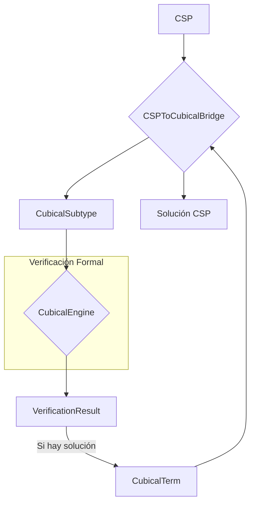

# Diseño en Profundidad: Gap 1 - Puente CSP ↔ Tipos Cúbicos

**Proyecto:** LatticeWeaver  
**Versión:** 8.0-alpha  
**Fecha:** 15 de Octubre, 2025  
**Autor:** Manus AI  
**Propósito:** Documento de diseño para cerrar el Gap 1, implementando un puente bidireccional entre la representación de Problemas de Satisfacción de Restricciones (CSP) y el sistema de Tipos Cúbicos (HoTT).

---

## 1. Visión y Objetivos

### 1.1. Objetivo Principal

El objetivo es crear un puente robusto y canónico, `CSPToCubicalBridge`, que traduzca un CSP a una representación formal en el sistema de tipos cúbicos. Esto permitirá:

1.  **Verificación Formal:** Utilizar el motor de tipos cúbicos para verificar formalmente propiedades del CSP, como la existencia (o no) de soluciones.
2.  **Extracción de Propiedades:** Extraer propiedades estructurales profundas del espacio de búsqueda (simetrías, componentes conexas, etc.) que no son evidentes en la representación clásica.
3.  **Resolución Asistida Formalmente:** Eventualmente, usar el sistema de tipos para guiar la búsqueda de soluciones de forma más inteligente.
4.  **Bidireccionalidad:** Traducir soluciones encontradas en el mundo cúbico de vuelta a asignaciones de variables del CSP.

### 1.2. Adherencia a los Principios de Diseño

Este diseño sigue los meta-principios de LatticeWeaver:

-   **Modularidad:** El puente será un componente autocontenido en `lattice_weaver/formal/`, con una interfaz clara y sin dependencias cíclicas.
-   **No Redundancia (Canonicalización):** La traducción de un CSP a su tipo cúbico será determinista y canónica, asegurando que CSPs isomorfos se traduzcan a tipos equivalentes.
-   **Aprovechamiento de la Información:** El objetivo es precisamente crear una representación más rica en información que la original.
-   **Generalidad:** El puente debe ser capaz de manejar cualquier CSP, no solo familias específicas.

---

## 2. Mapeo Conceptual: CSP a Tipos Cúbicos

La idea central es representar el **espacio de búsqueda completo** de un CSP como un único **tipo cúbico**. Las soluciones son entonces **caminos** o **puntos** dentro de este tipo.

| Concepto CSP | Concepto en Tipos Cúbicos | Implementación Propuesta | Descripción |
| :--- | :--- | :--- | :--- |
| **Variable** `v_i` | Una dimensión en un producto cartesiano | `CubicalDimension(name: str)` | Cada variable introduce un grado de libertad. |
| **Dominio** `D_i` | Un tipo finito `Fin(n)` | `CubicalFiniteType(size: int)` | Representa el conjunto discreto de posibles valores. |
| **Espacio de Búsqueda** | Un tipo producto (Sigma Type) `Σ(v₁:D₁), ..., Σ(vₙ:Dₙ)` | `CubicalSigmaType(dimensions: List)` | El producto cartesiano de todos los dominios. |
| **Restricción** `C(vᵢ, vⱼ)` | Un tipo de igualdad o predicado `P` | `CubicalPredicate(path_equality)` | Una restricción `vᵢ = vⱼ` se traduce a un tipo de camino `Path(vᵢ, vⱼ)`. |
| **Espacio de Soluciones** | Un subtipo `{ s: SearchSpace | P(s) }` | `CubicalSubtype(base_type, predicate)` | El subconjunto del espacio de búsqueda que satisface todas las restricciones. |
| **Solución** | Un habitante (término) del tipo de soluciones | `CubicalTerm(path_constructor)` | Un punto específico en el espacio de soluciones. |

---

## 3. Diseño de Clases y Módulos

### 3.1. Estructura de Archivos

```
lattice_weaver/formal/
├── cubical_types.py         # (NUEVO) Clases base para tipos cúbicos
├── csp_cubical_bridge.py    # (NUEVO) El puente principal
├── cubical_engine.py        # Motor de verificación (existente)
└── ...
```

### 3.2. `cubical_types.py` - Tipos Base

Este nuevo archivo contendrá las clases que representan los conceptos del sistema de tipos.

```python
# lattice_weaver/formal/cubical_types.py

from abc import ABC, abstractmethod

class CubicalType(ABC):
    """Clase base para cualquier tipo cúbico."""
    @abstractmethod
    def to_string(self) -> str:
        pass

class CubicalFiniteType(CubicalType):
    """Representa un tipo finito Fin(n)."""
    def __init__(self, size: int):
        self.size = size

class CubicalSigmaType(CubicalType):
    """Representa un tipo producto dependiente (Sigma)."""
    def __init__(self, components: List[Tuple[str, CubicalType]]):
        # Ejemplo: [("v1", CubicalFiniteType(3)), ("v2", CubicalFiniteType(3))]
        self.components = components

class CubicalPredicate(CubicalType):
    """Representa un predicado sobre un tipo, como una igualdad."""
    def __init__(self, left_term, right_term):
        # Representa la igualdad `left_term = right_term`
        self.left = left_term
        self.right = right_term

class CubicalSubtype(CubicalType):
    """Representa un subtipo { x: A | P(x) }."""
    def __init__(self, base_type: CubicalType, predicate: CubicalPredicate):
        self.base_type = base_type
        self.predicate = predicate
```

### 3.3. `csp_cubical_bridge.py` - El Puente

Este módulo contendrá la lógica principal de la traducción.

```python
# lattice_weaver/formal/csp_cubical_bridge.py

from lattice_weaver.core import CSP
from .cubical_types import CubicalType, CubicalSigmaType, CubicalFiniteType, ...

class CSPToCubicalBridge:
    """Traduce un CSP a su representación cúbica y viceversa."""

    def to_cubical(self, csp: CSP) -> CubicalSubtype:
        """Convierte un CSP en un tipo cúbico que representa su espacio de soluciones."""
        # 1. Traducir variables y dominios a un SigmaType
        search_space = self._translate_search_space(csp)

        # 2. Traducir restricciones a un predicado compuesto
        predicate = self._translate_constraints(csp)

        # 3. Combinar en un subtipo
        solution_space = CubicalSubtype(search_space, predicate)
        return solution_space

    def from_cubical_solution(self, cubical_term: CubicalTerm) -> Dict[str, Any]:
        """Traduce un término/habitante del tipo cúbico a una solución de CSP."""
        # Lógica para decodificar el término en una asignación de variables
        pass

    def _translate_search_space(self, csp: CSP) -> CubicalSigmaType:
        # Itera sobre csp.variables y csp.domains
        # Crea una lista de componentes (nombre_var, CubicalFiniteType(len(dominio)))
        # Retorna un CubicalSigmaType
        pass

    def _translate_constraints(self, csp: CSP) -> CubicalPredicate:
        # Itera sobre csp.constraints
        # Para cada restricción, crea un CubicalPredicate
        # Combina todos los predicados en uno solo (ej. con AND lógico)
        # Esta es la parte más compleja.
        pass
```

---

## 4. Flujo de Trabajo y Verificación

El flujo de uso será coordinado por la `VerificationStrategy`.



1.  La `CubicalVerificationStrategy` recibe un `CSP`.
2.  Invoca `CSPToCubicalBridge.to_cubical(csp)` para obtener el `CubicalSubtype` que representa el espacio de soluciones.
3.  Pasa este tipo al `CubicalEngine` para que verifique si el tipo está habitado (es decir, si tiene al menos un término).
4.  El `CubicalEngine` retorna un `VerificationResult`.
5.  Si el tipo está habitado, el resultado puede incluir un término de ejemplo (`CubicalTerm`).
6.  Este término se pasa a `CSPToCubicalBridge.from_cubical_solution()` para obtener la solución en formato CSP.

---

## 5. Plan de Implementación Incremental

El desarrollo se dividirá en las siguientes subtareas:

1.  **Semana 1: Fundamentos y Espacio de Búsqueda**
    -   [ ] **Tarea 1.1:** Implementar todas las clases base en `lattice_weaver/formal/cubical_types.py`.
    -   [ ] **Tarea 1.2:** Implementar la estructura de `CSPToCubicalBridge`.
    -   [ ] **Tarea 1.3:** Implementar `_translate_search_space` para convertir variables y dominios en un `CubicalSigmaType`.
    -   [ ] **Tests:** Tests unitarios para `cubical_types` y para la traducción del espacio de búsqueda.

2.  **Semana 2: Restricciones Simples y Bidireccionalidad**
    -   [ ] **Tarea 2.1:** Extender `_translate_constraints` para manejar restricciones binarias de igualdad (`v1 = v2`) y desigualdad (`v1 != v2`).
    -   [ ] **Tarea 2.2:** Implementar `from_cubical_solution` para decodificar soluciones simples.
    -   [ ] **Tests:** Tests de integración para un CSP simple (ej. 2 variables, 1 restricción) de ida y vuelta.

3.  **Semana 3-4: Restricciones Complejas y Verificación**
    -   [ ] **Tarea 3.1:** Extender `_translate_constraints` para manejar restricciones `AllDifferent` y restricciones aritméticas lineales.
    -   [ ] **Tarea 3.2:** Integrar el puente con una versión mock o real del `CubicalEngine`.
    -   [ ] **Tarea 3.3:** Implementar la `CubicalVerificationStrategy` para orquestar el flujo completo.
    -   [ ] **Tests:** Tests end-to-end con problemas conocidos (N-Queens 3x3, Sudoku 2x2) para verificar la corrección.

---

## 6. Estrategia de Pruebas

-   **Tests Unitarios:** Cada clase en `cubical_types.py` y cada método en `csp_cubical_bridge.py` tendrá tests aislados.
-   **Tests de Integración:** Se probará la traducción completa de CSPs de ejemplo (como un problema de coloreado de grafos simple) a su tipo cúbico, verificando que la estructura del tipo sea la esperada.
-   **Tests End-to-End:** Se utilizarán problemas de la suite de `problems/` para verificar el flujo completo: `CSP -> Tipo -> Verificación -> Solución CSP`.
-   **Cobertura:** El objetivo es alcanzar una cobertura de tests superior al 90% para los nuevos módulos.

---

## 7. Riesgos y Mitigaciones

-   **Riesgo 1 (Alto):** La traducción de restricciones complejas (no lineales, globales) a predicados cúbicos puede ser computacionalmente intratable o teóricamente muy difícil.
    -   **Mitigación:** Empezar con un subconjunto de restricciones comunes (igualdad, desigualdad, `AllDifferent`). Para restricciones más complejas, se pueden usar "tipos opacos" que se pasan al motor de verificación sin una definición interna completa, si el motor lo permite.
-   **Riesgo 2 (Medio):** El rendimiento del `CubicalEngine` al verificar los tipos generados puede ser un cuello de botella.
    -   **Mitigación:** El diseño del puente debe ser agnóstico al rendimiento del motor. La optimización del motor es una tarea separada. Sin embargo, se pueden añadir optimizaciones en el puente para generar tipos más simples cuando sea posible.

---

Este documento servirá como guía para la implementación del Gap 1. Antes de comenzar, se solicitará la validación del diseño para asegurar el alineamiento con la visión del proyecto.

